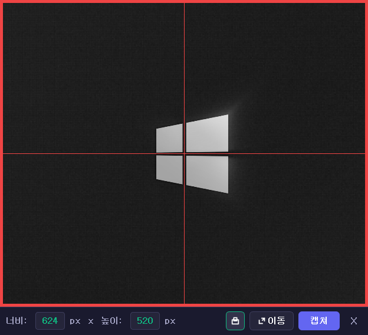

# Screen Capture Tool

[](https://www.python.org/)
[](https://pypi.org/project/PyQt5/)
[](https://pypi.org/project/Pillow/)
[](LICENSE)

PyQt5 기반의 프레임리스 화면 캡처 도구입니다.



## 기술 스택

- **Python** 3.8+
- **PyQt5** - GUI 프레임워크
- **Pillow** - 이미지 처리

## 프로젝트 구조

```
capture/
├── main.py              # 애플리케이션 진입점
├── constants.py         # 전역 상수 정의
├── requirements.txt     # 의존성 목록
├── core/                # 코어 로직
│   ├── __init__.py
│   └── capture.py       # 화면 캡처 기능
└── ui/                  # UI 컴포넌트
    ├── __init__.py      # 패키지 초기화 (__version__)
    ├── capture_window.py # 메인 윈도우
    ├── help_dialog.py   # 도움말 다이얼로그
    ├── icons.py         # QPainter 아이콘
    ├── styles.py        # Qt 스타일시트
    ├── toast.py         # 토스트 알림
    └── widgets.py       # 커스텀 위젯
```

## 개발 환경 설정

```bash
# 가상환경 생성
python -m venv .venv

# 가상환경 활성화 (Windows)
.venv\Scripts\activate

# 의존성 설치
pip install -r requirements.txt

# 실행
python main.py
```

## 아키텍처

### 핵심 클래스

| 클래스 | 파일 | 역할 |
|--------|------|------|
| `FinalCaptureWindow` | ui/capture_window.py | 메인 캡처 윈도우 |
| `ScreenCapture` | core/capture.py | 캡처 로직 |
| `Toast` | ui/toast.py | 토스트 알림 |
| `SilentLineEdit` | ui/widgets.py | 크기 입력 위젯 |

### 윈도우 특성

- **프레임리스**: `Qt.FramelessWindowHint`
- **투명 배경**: `Qt.WA_TranslucentBackground`
- **항상 위**: `Qt.WindowStaysOnTopHint`
- **QRegion 마스킹**: 캡처 영역은 클릭 투과, 테두리는 상호작용 가능

### 캡처 모드

```python
class CaptureMode(Enum):
    CLIPBOARD_ONLY = auto()  # 클립보드만
    FILE_ONLY = auto()       # 파일만
    BOTH = auto()            # 둘 다 (기본값)
```

## 코드 컨벤션

- **PEP 8** 준수
- **타입 힌트** 필수
- **Docstring** 한글 작성
- **로깅** `logging` 모듈 사용

### Import 순서

```python
# 1. 표준 라이브러리
import logging
from typing import Optional

# 2. 서드파티
from PyQt5.QtWidgets import QWidget

# 3. 로컬
from ui.styles import Styles
```

## 버전

**v0.0.1**
